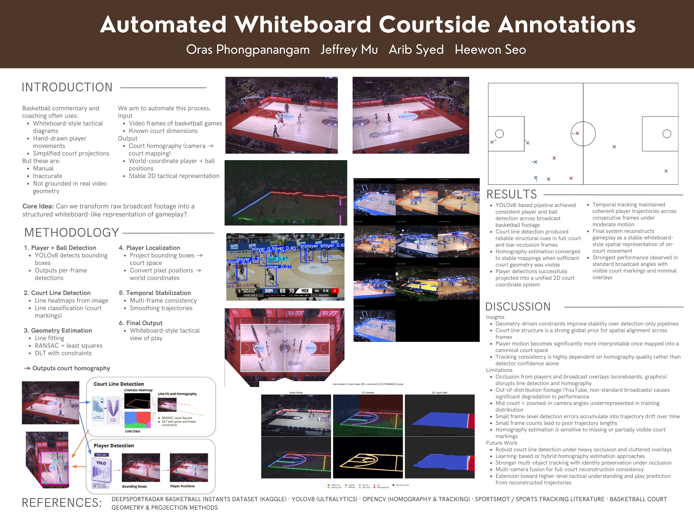

# Read our report: https://drive.google.com/file/d/1quLXYc6nOp9BJv-ZDTs0FUTvrQu48cSc/view?usp=sharing

# PixelPlayers: Automated Whiteboard Basketball Annotations
Basketball coaches and players rely heavily on game film to review opposing formations and develop counter-strategies, a process that typically involves manually scrubbing footage and sketching out plays on a whiteboard. While this workflow is central to how teams prepare, it can be time-intensive across a full season of film. Our goal is to augment this process by generating visual patterns or formations for coaches and players to work with. We present **PixelPlayers**, an end-to-end framework that derives basketball player and ball tracking instances through fine-tuned video supervision. The system produces annotated whiteboard-style play diagrams overlaid on footage, designed to serve as a starting point for game analysis.

## Setup

```bash
uv sync
```

## Structure

```
code/      source code
data/      raw footage and datasets
models/    model weights and checkpoints
results/   outputs and visualizations
```
